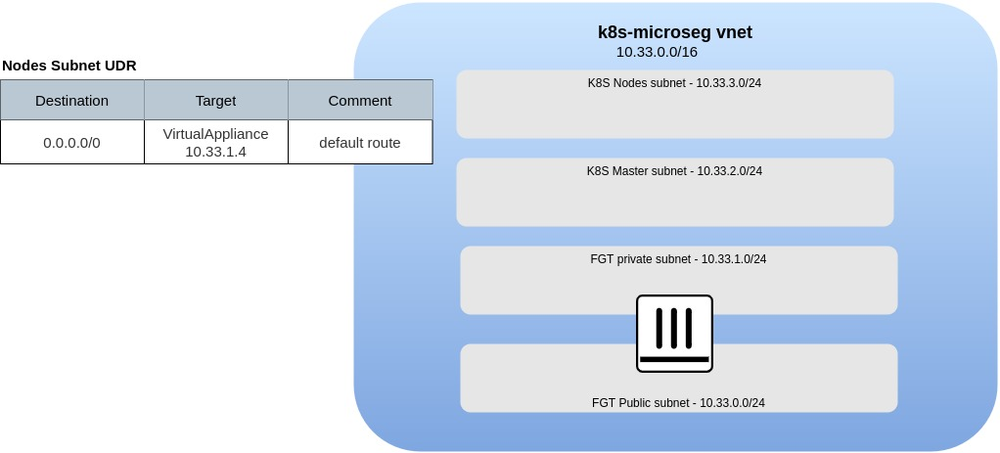

# Azure K8S Micro Segmentation Workshop

## Workshop main objectives

* Deploy a Kubernetes Cluster
* Deploy Azure Automation
* Micro Segmentation of Kubernetes Pods with FortiGate Automation Stitches

## Chapter 1 - Preparation Steps [estimated duration 5min]

1. Ensure you have the following tools available in your cloudshell:

    * An Azure account with a valid subscription
    * An Azure Cloudshell

    * Clone the repository in your cloud shell

     

    * download aks-engine and transfer the binary to your home directory

```
wget https://github.com/Azure/aks-engine/releases/download/v0.64.0/aks-engine-v0.64.0-linux-amd64.zip
unzip aks-engine-v0.64.0-linux-amd64.zip
mv aks-engine-v0.64.0-linux-amd64/aks-engine ./
chmod +x aks-engine 
```    

## Chapter 2 - Create the environment [estimated duration 20min]

1. Create the environment using the Terraform code provided. At the end of this step you should have an environment similar to the below



2. Deploy the Self-Managed cluster using aks-engine. Customize the deployment file to your own environment
```
./aks-engine deploy --resource-group k8s-microseg --location eastus --api-model ./AzureMicroSeg/K8S/aks-calico-azure.json
```

3. Verify that the deployment is successful by listing the K8S nodes


At the end of this step you should have the following setup


4. Configure The FortiGate K8S Connector and verify that it's UP

    * Create a ServiceAccount for the FortiGate
    * Create a clusterrole
    * Create a clusterrolebinding
    * Extract the ServiceAccount secret token and configure the FortiGate

You can extract the secret token using the following command

```
kubectl get secrets -o jsonpath="{.items[?(@.metadata.annotations['kubernetes\.io/service-account\.name']=='fgt-svcaccount')].data.token}"| base64 --decode
```


5. Questions
**************

    * Why the aks-engine deployment created Load balancers?
    * Why a UDP/1123 load balacing rule has been created on the Master LB?    
    * How many PODs can the deployed Node accomodate?
    * If we want to protect communications to the Master Node through the FortiGate, what are the changes required ?    


## Chapter 3 - Create the RunBook and configure the FortiGate Automation Stitches

A FortiGate Automation Stitch brings together a trigger and an action. In this exercise the trigger is a log event and the action is the execution of a webhook.

* The trigger - a log event is generated when an IP address is added or removed from a dynamic address object
* The action - a webhook sends an HTTPS POST request to an endpoint in Azure. The endpoint runs a PowerShell script to update an Azure route table. The HTTP headers and JSON formatted body contain the information required to update the route table to manage micro-segmentation through the use of host routes. A host route is a route that indicates a specific host by using the IP-ADDRESS/32 in IPV4

This exercise covers the

* Setup of an Azure Automation Account
* Importing required Azure PowerShell Modules
* Creation and Publishing of Azure Runbook
* Creation of Webhook to invoke Azure Runbook
* Creation of FortiGate Dynamic Address
* Creation of FortiGate Automation Stitch
* Creation of FortiGate Automation Stitch Trigger
* Creation of FortiGate Automation Stitch Action

1. Azure Automation Account
    * Create Automation Account

        ```PowerShell
        New-AzResourceGroup -Name automation-01 -Location eastus2
        New-AzAutomationAccount -ResourceGroupName automation-01 -Location eastus2 -Name user-automation-01  -AssignSystemIdentity -Plan Basic
        ```

    * Setup Automation Account [Managed Identity] (<https://docs.microsoft.com/en-us/azure/active-directory/managed-identities-azure-resources/overview>)

        ```PowerShell
        New-AzRoleAssignment -ObjectId (Get-AzAutomationAccount -ResourceGroupName automation-01 -Name user-automation-01).Identity.PrincipalId -RoleDefinitionName "Contributor"
        ```

    * Import Az PowerShell Modules
        * Az.Accounts - This module needs to be imported first as the other modules have a dependency on it
        * Az.Automation
        * Az.Compute
        * Az.Network
        * Az.Resources

        ```PowerShell
        Import-AzAutomationModule -ResourceGroupName automation-01 -AutomationAccountName user-automation-01 -Name Az.Accounts  -ContentLinkUri https://www.powershellgallery.com/api/v2/package/Az.Accounts
        @("Automation","Compute","Network","Resources") | ForEach-Object {Import-AzAutomationModule -ResourceGroupName automation-01 -AutomationAccountName user-automation-01 -Name Az.$_  -ContentLinkUri https://www.powershellgallery.com/api/v2/package/Az.$_}
        ```

2. Azure Automation Runbook
    * Create, Import, and Publish Runbook

        ```PowerShell
        New-AzAutomationRunbook -ResourceGroupName automation-01 -AutomationAccountName user-automation-01 -Name ManageDynamicAddressRoutes -Type PowerShell
        Import-AzAutomationRunbook -Name ManageDynamicAddressRoutes -ResourceGroupName automation-01 -AutomationAccountName user-automation-01 -Path .\ManageDynamicAddressRoutes.ps1 -Type PowerShell –Force
        Publish-AzAutomationRunbook -ResourceGroupName automation-01 -AutomationAccountName user-automation-01 -Name ManageDynamicAddressRoutes
        ```

    * Create Webhook

        ```PowerShell
        New-AzAutomationWebhook -ResourceGroupName automation-01 -AutomationAccountName user-automation-01 -RunbookName ManageDynamicAddressRoutes -Name routetableupdate -IsEnabled $True -ExpiryTime "07/12/2022" -Force
        ```

        The output will include the URL of the enabled webhook. The webhook is only viewable at creation and cannot be retrieved afterwards. The output will look similar to below.

        ```text
        ResourceGroupName     : automation-01
        AutomationAccountName : user-automation-01
        Name                  : routetableupdate
        CreationTime          : 7/13/2021 8:33:28 PM +00:00
        Description           :
        ExpiryTime            : 7/12/2022 12:00:00 AM +00:00
        IsEnabled             : True
        LastInvokedTime       : 1/1/0001 12:00:00 AM +00:00
        LastModifiedTime      : 7/13/2021 8:33:28 PM +00:00
        Parameters            : {}
        RunbookName           : ManageDynamicAddressRoutes
        WebhookURI            : https://f5f015ed-f566-483d-c972-0c2c3ca2a296.webhook.eus2.azure-automation.net/webhooks?token=P1GSd4Tasf5i1VYaVkFQvG29QCjkA8AOHY%2bsVLZOFSA%3d
        HybridWorker          :
        ```

3. FortiGate Dynamic Address
    * Create Dynamic Address
        * Filter
4. FortiGate Automation Stitch
    * Trigger
        * Log Address Added
        * Log Address Removed
    * Action
        * Webhook
        * Body
        * Headers
    * Stitch
        * Trigger
        * Action

5. Questions
